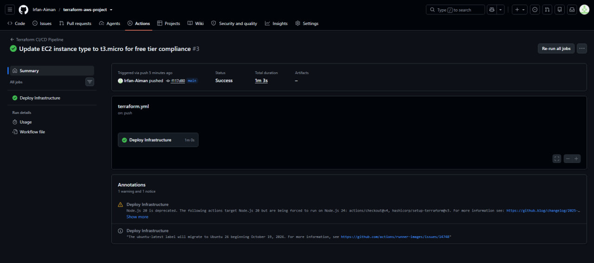
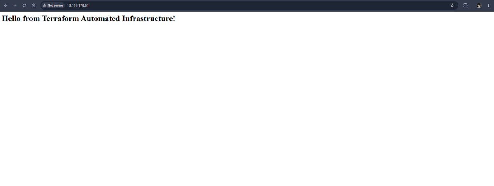

# ☁️ Automated AWS Infrastructure Provisioning with CI/CD

`BUILT WITH TERRAFORM` `SKILL INFRASTRUCTURE AS CODE (IAC)` `AUTOMATION GITHUB ACTIONS`

Automated AWS Infrastructure Provisioning is a complete Infrastructure as Code (IaC) deployment pipeline. Instead of manually configuring cloud resources through the AWS Console, this project defines the entire network and compute architecture in Terraform and automates the deployment process using GitHub Actions CI/CD. 

🔗 **Status:** Successfully Deployed & Validated

---

## 🏗️ Architecture Overview

The pipeline automatically provisions a secure, foundational cloud environment in the AWS `ap-southeast-1` (Singapore) region.

*   **VPC (Virtual Private Cloud):** An isolated network environment (`10.0.0.0/16`).
*   **Public Subnet:** A sub-network mapped to a specific Availability Zone.
*   **Internet Gateway & Route Table:** Configured to allow outbound and inbound internet access to the public subnet.
*   **Security Group:** A virtual firewall restricting inbound traffic strictly to SSH (Port 22) and HTTP (Port 80).
*   **EC2 Instance:** A `t3.micro` Amazon Linux 2023 server bootstrapped with an Apache Web Server via a user-data bash script.

---

## 🚀 The CI/CD Automation Pipeline

This project enforces DevOps best practices by entirely removing manual intervention from the deployment process.

1.  **Version Control:** Infrastructure states are defined in `.tf` files.
2.  **Continuous Integration:** Pushing code to the `main` branch automatically triggers the GitHub Actions workflow.
3.  **Continuous Deployment:** The runner authenticates securely with AWS via IAM Access Keys (stored as GitHub Secrets), executes `terraform plan` to verify changes, and runs `terraform apply` to provision the resources.

### Pipeline Execution Proof

---

## 📸 Deployment Validation

Upon successful pipeline execution, Terraform outputs the dynamic Public IP address of the provisioned EC2 instance. Navigating to this IP confirms the automated installation and configuration of the Apache web server.

---

## 🛠️ Technologies Used
*   **Cloud Provider:** Amazon Web Services (AWS)
*   **Infrastructure as Code:** Terraform (HCL)
*   **CI/CD:** GitHub Actions
*   **Version Control:** Git & GitHub
*   **Scripting:** Bash (EC2 User Data)