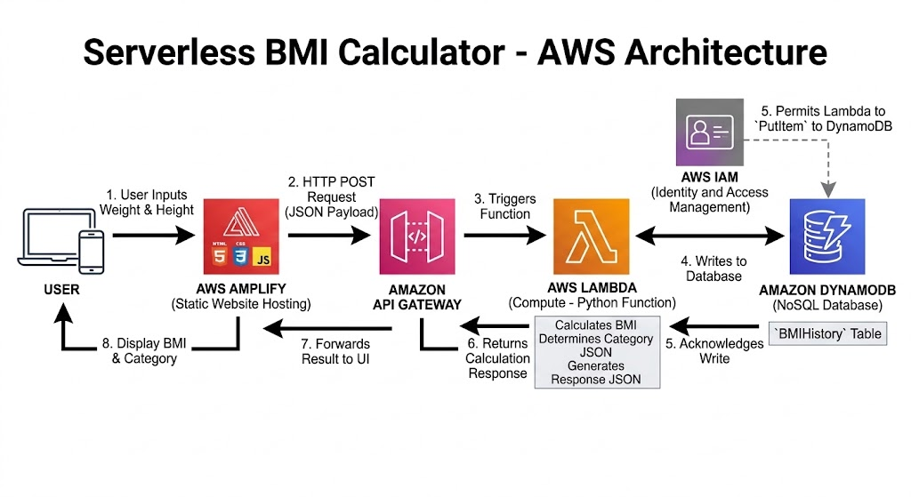

# Serverless BMI Calculator on AWS ☁️🧮

## Project Overview
A fully serverless web application that calculates Body Mass Index (BMI) and securely stores calculation history in the cloud. I built this project to apply my cloud computing training into a hands-on architecture, demonstrating my ability to integrate frontend interfaces with AWS backend services.

**Live Demo:** [https://staging.d3p6yi8jjf7r3s.amplifyapp.com/]

## 🏗️ Architecture

The application follows a standard serverless microservices architecture:
1. **Frontend:** Hosted on **AWS Amplify**, providing a lightweight HTML/JS/CSS interface.
2. **API Layer:** **Amazon API Gateway** receives RESTful HTTP POST requests from the frontend and routes them to the backend.
3. **Compute:** **AWS Lambda** (Python) processes the payload, performs the BMI calculation, determines the health category, and returns the response.
4. **Database:** **Amazon DynamoDB** stores a permanent record of every calculation using an auto-generated UUID.
5. **Security:** **AWS IAM** roles and policies adhere to the principle of least privilege, granting Lambda explicit permission to write to DynamoDB and log to CloudWatch.

## 🛠️ Tech Stack
* **Cloud Provider:** Amazon Web Services (AWS)
* **Compute:** AWS Lambda (Python 3.12)
* **Database:** Amazon DynamoDB (NoSQL)
* **API Routing:** Amazon API Gateway (HTTP API, CORS configured)
* **Hosting:** AWS Amplify
* **Frontend:** HTML, CSS, Vanilla JavaScript

## 🧠 What I Learned
* **API Integration:** Configuring CORS in API Gateway so a web browser can securely communicate with backend services.
* **Serverless Compute:** Writing Python functions in Lambda that extract JSON payloads from HTTP requests.
* **NoSQL Databases:** Using the `boto3` library in Python to interact with DynamoDB and insert structured items.
* **IAM Security:** Creating custom inline JSON policies to securely connect Lambda and DynamoDB.

## 🚀 How to Run Locally
1. Clone this repository.
2. Open `Frontend/index.html` in any web browser.
3. *Note: The frontend relies on the live AWS API Gateway endpoint to function.*